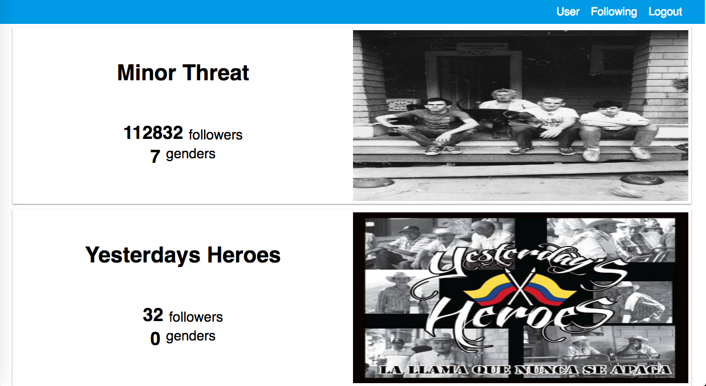

# Spotify Api con React.js

> Se debe tener instalado `create-react-app` para ejecutar correctamente este proyecto.

> Se deben definir en el proyecto `server` las variables de entorno llamadas `SPOTIFY_CLIENT_ID` y `SPOTIFY_CLIENT_SECRET`. Para esto se pueden usar en entornos Linux/MacOS se pueden ejecutar los siguientes comandos:

```
    export SPOTIFY_CLIENT_ID=my-client-id

    export SPOTIFY_CLIENT_SECRET=my-client-secret
```

> Recuerde que para tener estos datos debe tener cuenta en spotify como desarrollador. Esta cuenta se puede conseguir en el siguiente enlace [Sitio de desarroladores de spotify](https://developer.spotify.com/dashboard/)

## Para ejecutar el proyecto

1. Se deben instalar las dependencias en el directorio `server` y en el directorio `spotify-api-test`
2. Iniciar cada proyecto con cualquier de los siguientes comandos

> yarn start

> npm start

## Flujo de la app

### Login
Sólo se da click en el botón que dice login. Luego de ésto se redirige a la página de spotify para iniciar sesión y obtener las credenciales. Luego de obtenidas se redirige automáticamente al sitio local donde se muestra la información del usuario


### Mostrar información básica del usuario


### Obtener los artistas que estoy siguiendo



### Cerrar sesión
En cualquier sección se puede dar click en el botón que dice Logout para cerrar sesión.
